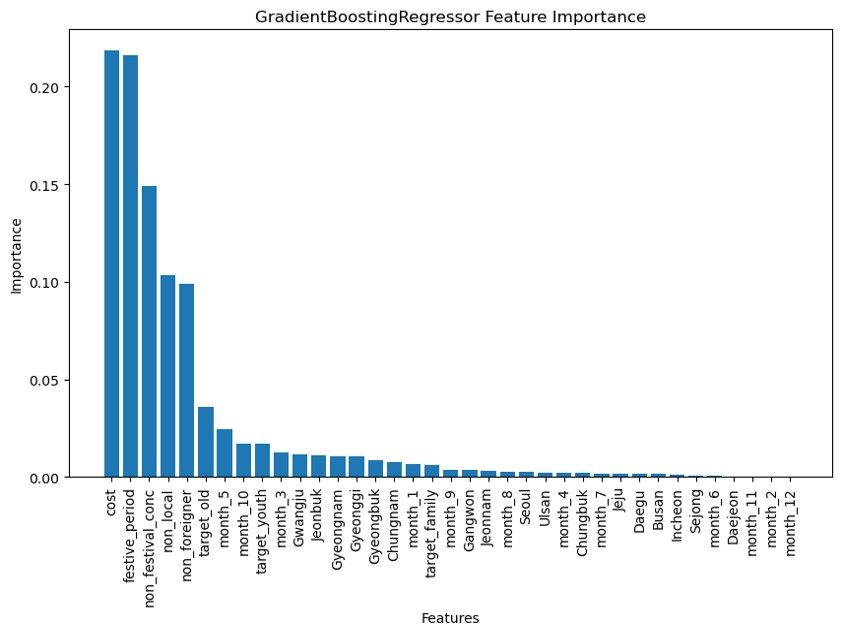
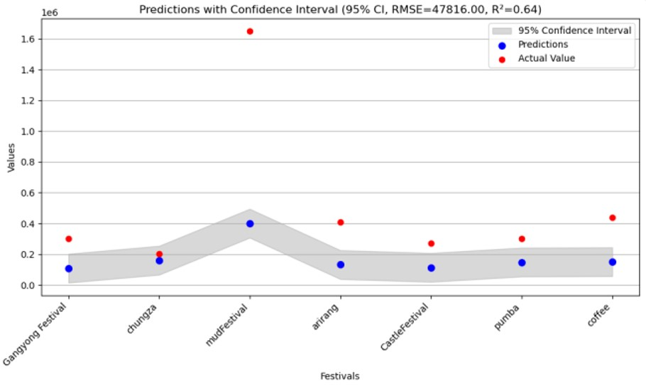

# 1. 지방 축제의 방문자 수 예측 프로젝트

## **프로젝트 개요**
2024년 1,170개의 지역 축제가 계획되어 있었다. 그 중에는 유명한 축제도 있지만 이름도 생소한 소규모 축제가 대다수이다. 
국민의 세금으로 개최됨에도 아무도 오지 않는 축제는 자원 낭비일 뿐이다.
따라서 축제 성공의 핵심 지표인 방문자 수 예측을 통해 예산 및 자원의 최적화를 목표로 한다.
<br><br>
  
## 2. **사용 기술**
- **Python**: 데이터 분석 및 머신러닝 모델링
  - **NumPy**: 수치 계산 및 데이터 처리
  - **Pandas**: 데이터 프레임 처리 및 분석
  - **Matplotlib, Seaborn**: 데이터 시각화
  - **Scikit-learn**: 모델 학습, 평가 및 하이퍼파라미터 튜닝
  - **XGBoost**: Gradient Boosting 알고리즘 기반 모델 구현
  - **RapidFuzz**: 텍스트 유사도 계산 및 데이터 정규화
  - **Joblib**: 모델 저장 및 로드
  <br><br>

## 3. 모델 종류
### 3.1. 초기 모델 (visitors_predict_v2.ipynb)
- **사용 모델**: Stacking Regressor (Lasso + Random Forest + XGBoost)
- **주요 성과**:
  - **RMSE**: 883.60
  - **R²**: 0.9999
- **문제점**:
  - **과대적합**: 검증 데이터에서 RMSE는 낮으나, R² 값이 훈련 데이터와 과도하게 일치 (일반화 성능 부족)
  - **변수 비효율성**: 타겟 변수와 유사한 변수가 포함되어 예측 성능 저하
  - **이상치 처리 부족**: 극단적인 데이터가 모델의 성능에 영향을 미침


### 3.2. 최종 모델 (visitcost_iqr_ver3.ipynb)
- **사용 모델**: GradientBoostingRegressor (최적화된 단일 모델)
- **주요 성과**:
  - **RMSE**: 228,636,955.67
  - **R²**: 0.64
- **하이퍼파라미터 최적화**:
  - `learning_rate`: 0.03
  - `max_depth`: 5
  - `n_estimators`: 210
  - `subsample`: 0.7
- **변수 중요도**:
  - **총비용(cost)**
  - **축제 기간(festive_period)**
  - **방문자 구성 비율**: 지역 및 연령별 방문자 특성과 밀접한 연관
- **전처리 및 개선**:
  - IQR 기반 이상치 처리로 데이터 신뢰성 확보
  - One-Hot Encoding을 통해 범주형 변수 정리
  - 결측치 처리: 축제 기간 결측치를 평균값으로 대체


### 3.3. 초기 모델 대비 성능 향상
- **일반화 성능 개선**: 초기 모델에서 발생했던 과대적합 문제를 해결하여, 검증 데이터에서 더 안정적인 성능 확보
- **데이터 신뢰성 증가**:
  - 이상치 처리 및 변수 정리로 더 나은 입력 데이터 품질 확보
  - 불필요한 변수 제거 및 하이퍼파라미터 최적화로 예측 정확도 개선
- **모델 간소화**:
  - Stacking 구조 대신 GradientBoostingRegressor 단일 모델을 사용하여 계산 비용 감소 및 실시간 활용 가능성 증가


### 3.4. 성능 비교 표
| 모델                | 평가 지표         | 값              | R² 값       | 주요 문제점/개선 사항                    |
|---------------------|-------------------|-----------------|-------------|------------------------------------------|
| 초기 모델           | RMSE             | 883.60          | 0.9999      | 과대적합, 이상치 처리 부족, 변수 비효율성 |
| 최종 모델           | MSE              | 228,636,955.67  | 0.64        | 데이터 신뢰성 확보, 일반화 성능 개선       |


<br><br>
## 4. 시각화 결과
### 4.1. 변수 중요도 (Feature Importance)
최종 모델(GradientBoostingRegressor)이 예측에 가장 중요한 변수로 총비용과 축제 기간을 선정




### 4.2. 최종 모델 예측 결과
최종 모델의 예측값과 실제값(2024년)의 비교 예측값은 대체로 실제값과 비슷한 방향으로 움직이는 경향
(단, 보령머드축제와 같은 이상치 제외)


<br><br>


## 5. 폴더구조
```plaintext
📁 FESTIVAL
├── 📁 analysis      --- 데이터 분석 및 시각화
├── 📁 data          --- 실제 분석/모델에 사용된 데이터
│   └── 📁 raw       --- 원본 데이터 
│   └── 📁 processed --- 전처리된 데이터
├── 📁 models        --- 모델 관련 코드
├── 📁 preprocessing -- 전처리 코드 
├── 📁 saved_models  --- 학습된 모델 저장
└── 📄 README.md
```

